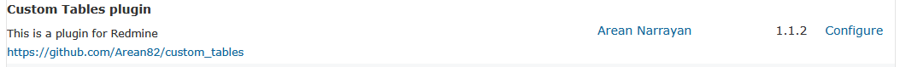
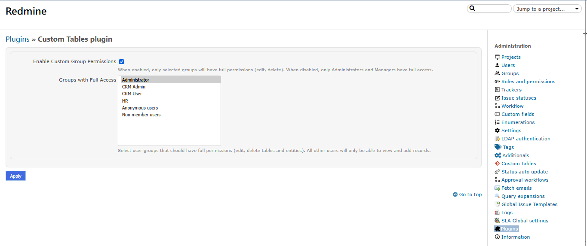

Redmine Custom Tables
==================

This plugin provides a possibility to create custom tables. The table is built with Redmine custom fields. It allows you to create any databases you need for your business and integrate it into your workflow processes.


## 🆕 Enhanced Features & Modifications

**Custom Modifications Added:**
- **Advanced Permission System** - Configurable group-based access control
- **Role-Based Restrictions** - Fine-grained control over edit/delete permissions
- **Admin Settings Interface** - Easy configuration via plugin settings page
- **Enhanced Security** - Controller-level and view-level permission checks




Features
-------------
* Table constructor
* Filtering 
* Sorting 
* Grouping
* Integration with issues
* History of changes
* Commenting entities
* Export CSV/PDF
* API
* **🆕 Configurable permission system** - Control which user groups can edit and delete records
* **🆕 Role-based access control** - Restrict operations to specific roles (Administrator, Manager)
* **🆕 Settings configuration page** - Easy management of permissions via admin interface

Compatibility
-------------
* Redmine 5.0.0 or higher

Installation and Setup
----------------------

* Clone or [download](https://github.com/Arean82/custom_tables/archive/refs/heads/master.zip) this repo into your **redmine_root/plugins/** folder

```
$ git clone https://github.com/Arean82/custom_tables.git
```
* If you downloaded a tarball / zip from master branch, make sure you rename the extracted folder to `custom_tables`
* You have to run the plugin rake task to provide the assets (from the Redmine root directory):
```
$ bundle exec rake redmine:plugins:migrate RAILS_ENV=production
```
* Restart redmine

Usage
----------------------
### Basic Setup
1) Visit **Administration->Custom tables** to open table constructor. 
2) Press button **New table**. Fill the name field, select projects you want to enable table on and submit the form.
3) Add custom fields to your new table.
4) Give access to the users **Administration -> Roles and permissions -> Project -> Manage custom tables**

### 🆕 Enhanced Permission Configuration
The plugin includes a **flexible and configurable permission system** that allows precise control over who can edit and delete custom table records:

#### Default Behavior (When Custom Permissions Disabled)
- **Administrators**: Full access (create, edit, delete)
- **Managers**: Full access (create, edit, delete)  
- **Other Users**: View and add records only (edit/delete buttons hidden)

#### 🆕 Custom Group Permissions (Enhanced Feature)
You can configure specific user groups to have full access via the admin interface:

1. Go to **Administration → Plugins → Custom Tables plugin → Configure**
2. Check **"Enable Custom Group Permissions"** to activate custom group-based access
3. Select the user groups that should have full edit/delete permissions
4. Click **Save** to apply changes

#### 🆕 Multi-Layer Security
- **View-Level Security**: Delete/edit buttons are hidden from unauthorized users
- **Controller-Level Security**: All destructive actions are blocked at the controller level
- **Role-Based Security**: Built-in support for Administrator and Manager roles
- **Group-Based Security**: Custom group permissions via settings configuration

#### Permission Levels
- **Full Access Users** (Admins, Managers, or selected groups): Can create, edit, and delete tables and records
- **Standard Users**: Can view and add records, but cannot edit or delete existing ones

### 🆕 Technical Implementation Details
The enhanced permission system includes:
- **CustomTablesPermissionHelper** - Centralized permission logic
- **Controller-level before_actions** - Security at the action level
- **View-level conditionals** - UI element visibility control
- **Settings management** - Persistent configuration storage
- **Role and group validation** - Multi-factor permission checking

### API Access
The plugin provides API endpoints for managing custom tables and entities. API access follows the same permission rules as the web interface.

Support
-------
If you find any bugs, feel free to create an issue on GitHub or make a pull request.
https://github.com/frywer/custom_tables

Contributors
------------
* Ivan Ivon (@frywer)
* **🆕 Plugin customization and enhanced permission system** - Added configurable group-based permissions, role restrictions, and admin settings interface

License
-------
The plugin is available under the MIT license.

## 🆕 Changelog

### Enhanced Version Features:
- ✅ Configurable group-based permission system
- ✅ Admin settings page for easy permission management  
- ✅ Role-based restrictions (Administrator, Manager)
- ✅ Multi-layer security (view + controller level)
- ✅ Enhanced UI with conditional button visibility
- ✅ Persistent settings configuration
- ✅ Backward compatibility with existing installations


## Key Highlights of Your Modifications:

1. **🆕 Enhanced Features Section** - Clear overview of what you added
2. **🆕 Icon indicators** - Visual markers for new features
3. **🆕 Technical Details** - Explanation of the multi-layer security
4. **🆕 Implementation Details** - Technical architecture of your permission system
5. **🆕 Updated Contributors** - Credit for your enhancements
6. **🆕 Changelog** - Summary of all new features

